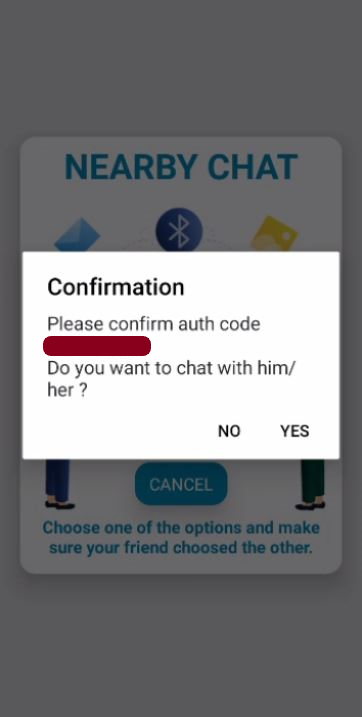
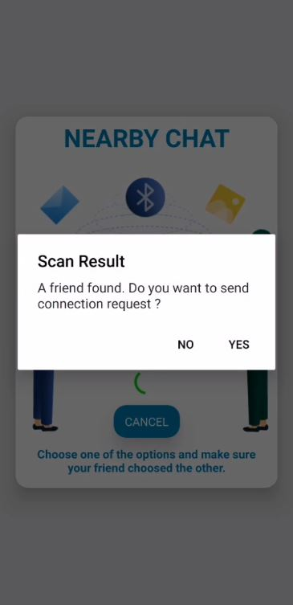
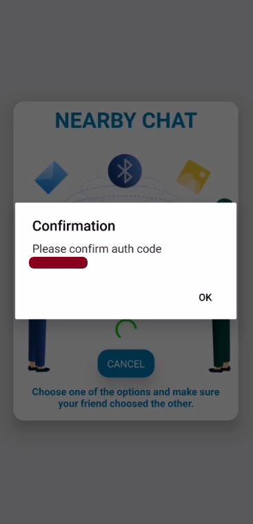
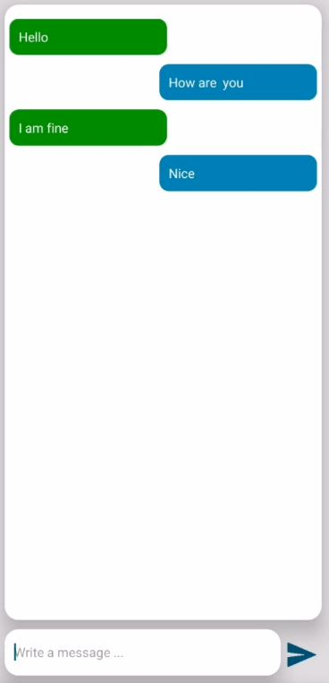
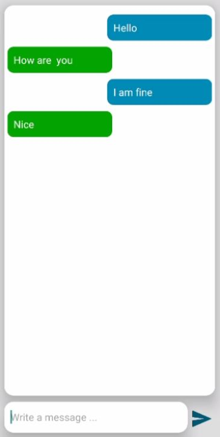

# Nearby Chat Application

## Introduction

This chat application shows an example use case of Nearby Connection in React Native HMS Nearby Service Plugin.

#### Note

You need 2 HMSCore APK installed phones to test this app.
This application is tested on Huawei P30 Lite and Huawei Y6.

## How to Run ?

Clone the code or download the zip file and then install the dependencies using command below.

```bash
npm i 
```

Put your **agconnect-services.json** and **keystore_file.jks** under **android > app** directory.

Then fill the **android > app > build.gradle** file as given below.

```groovy
defaultConfig {
    applicationId "<package_name>"  // your package name in agconnect-services.json
    ...
}

signingConfigs {
    config {
        storeFile file('<keystore_file>.jks') // your keystore filename
        storePassword '<keystore_password>'   // keystore password
        keyAlias '<key_alias>'                // key alias
        keyPassword '<key_password>'          // key password
        ...
    }
    ...
}
```

Run the application

```bash
npx react-native run-android
```

## Screenshots

Phone 1 Broadcaster           |  Phone 2 Scanner
:-------------------------:|:-------------------------:
 | 
| 
 | 
|| 
 | 

## Sources

### Plugin

**Installation** : [npmjs](https://www.npmjs.com/package/@hmscore/react-native-hms-nearby)

**Official Documentation Guide** : [Guide](https://developer.huawei.com/consumer/en/doc/development/HMS-Plugin-Guides/about-the-service-0000001053940431)

**Official Documentation Reference** : [Reference](https://developer.huawei.com/consumer/en/doc/development/HMS-Plugin-References/hms-application-0000001073654825)
